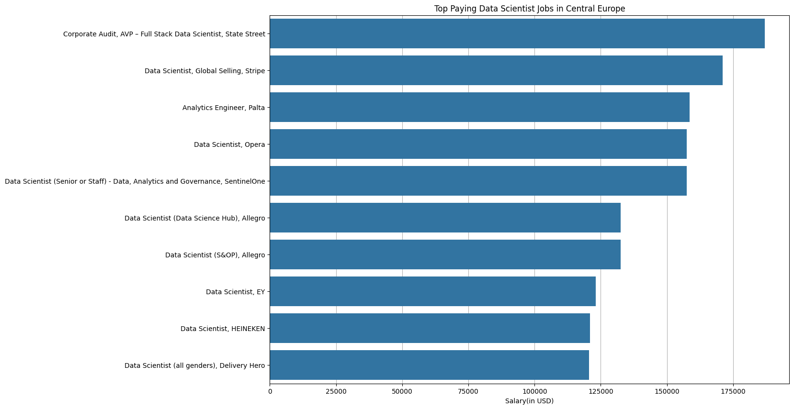
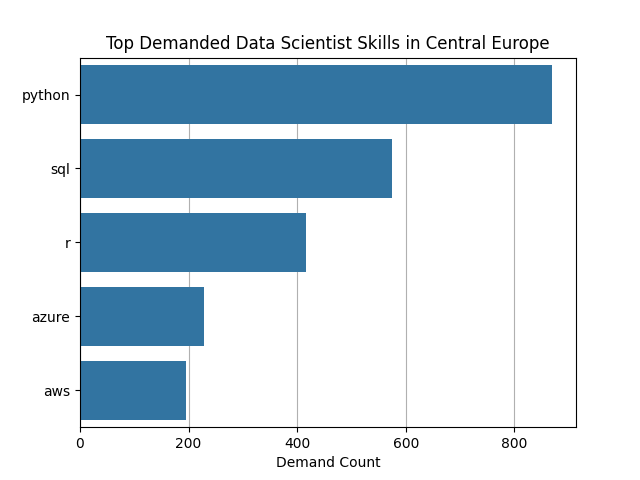
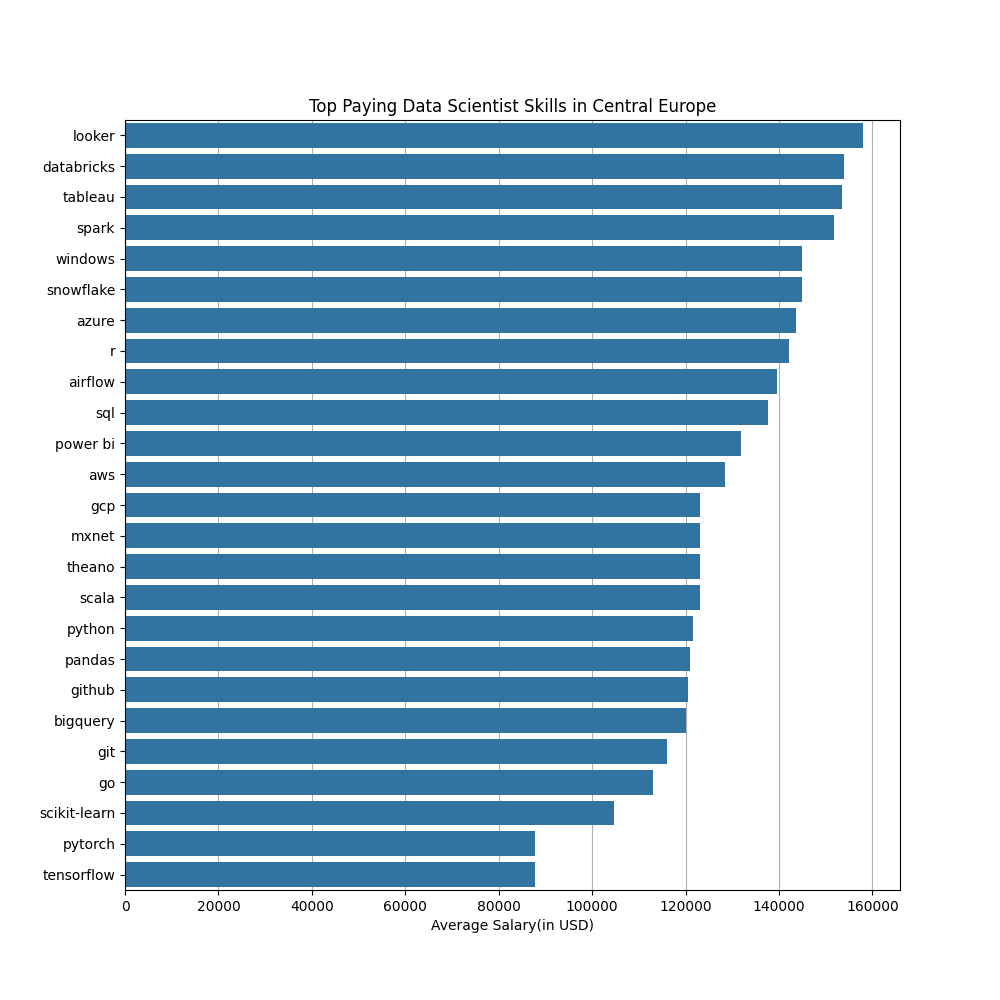
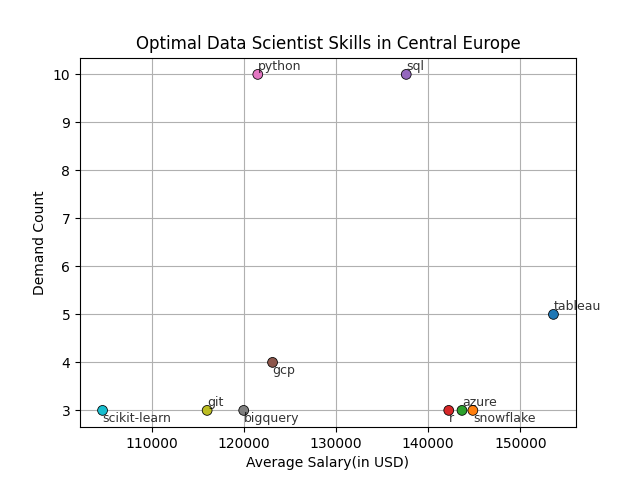

# Introduction
In this project I will be exploring Data Science job market in Central Europe. I will dive into top-paying roles, in-demand skills and the most optimal skills for Data Scientists.
SQL queries and Jupiter Notebook here: [project_sql folder](project_sql)
# Background
The Data Science field continues to evolve rapidly, with new tools, cloud platforms, and machine learning frameworks emerging every year. Central Europe has become an increasingly competitive region for tech talent, making it important to understand which skills provide the greatest career advantage.
## This project aims to identify:
- The top-paying Data Science roles
- What skills do they require
- The most frequently requested skills
- The highest-paying skills
- The most optimal skills
# Tools I Used
- **SQL** – for data querying and aggregation.
- **PostgreSQL** - chosen database management system.
- **VS Code** – as the primary development environment for writing and testing queries.
- **Git & GitHub** – for version control and project tracking.
- **Python** – for data visualization and presenting insights in a clear and structured way.
# The Analysis
Each query in this section investigates a specific aspect of the Data Science job market in Central Europe — from identifying the highest-paying roles to analyzing the most demanded and most valuable skills.
### 1. Top Paying Data Scientist Jobs
To identify highest-paying roles I filtered data by position(Data Scientist), by location(Countries of Central Europe), by average salary(not NULL) and ordered by average yearly salary. This query shows the highest-paying positions in Central Europe market. 
```sql
SELECT  
    job_id,
    job_title,
    name AS company_name,
    job_location,
    job_schedule_type,
    salary_year_avg,
    job_posted_date
FROM job_postings_fact
LEFT JOIN company_dim ON company_dim.company_id = job_postings_fact.company_id
WHERE 
    job_title_short = 'Data Scientist' AND
    job_location IN ('Germany', 
                    'Poland', 
                    'Czechia', 
                    'Austria', 
                    'Hungary', 
                    'Slovakia', 
                    'Slovenia', 
                    'Switzerland', 
                    'Liechtenstein') AND
    salary_year_avg IS NOT NULL
ORDER BY salary_year_avg DESC
LIMIT 10
```
The salary distribution ranges from approximately $120,000 to $187,000 per year, with most roles concentrated between $120,000 and $160,000, and one clear top position significantly above the rest (State Street in Poland). This indicates a relatively tight high-paying band, with executive-level roles pushing compensation higher.

Geographically, Poland dominates the list, hosting the majority of the top-paying roles. Germany appears twice, and Slovakia once, suggesting that Poland is currently the strongest market for high-compensation Data Science roles in Central Europe.

The companies offering these positions are primarily large international corporations and established tech firms, such as State Street, Stripe, SentinelOne, EY, and Delivery Hero, highlighting that global organizations lead the region in salary competitiveness.



*This chart shows the highest-paying Data Scientist jobs in Central Europe, with each bar representing a job title and its corresponding average annual salary in USD.*
### 2. Top Paying Data Scientist Jobs With Skills
To identify which skills are needed for each job I used previous query as a CTE and added skill names column.
```sql
WITH top_paying_jobs_in_CE AS (
    SELECT  
        job_id,
        job_title,
        name AS company_name,
        job_location,
        job_schedule_type,
        salary_year_avg,
        job_posted_date
    FROM job_postings_fact
    LEFT JOIN company_dim ON company_dim.company_id = job_postings_fact.company_id
    WHERE 
        job_title_short = 'Data Scientist' AND
        job_location IN ('Germany', 
                        'Poland', 
                        'Czechia', 
                        'Austria', 
                        'Hungary', 
                        'Slovakia', 
                        'Slovenia', 
                        'Switzerland', 
                        'Liechtenstein') AND
        salary_year_avg IS NOT NULL
        ORDER BY salary_year_avg DESC
        LIMIT 10
)
SELECT
    top_paying_jobs_in_CE.*,
    skills
FROM top_paying_jobs_in_CE
INNER JOIN skills_job_dim ON skills_job_dim.job_id = top_paying_jobs_in_CE.job_id
INNER JOIN skills_dim ON skills_dim.skill_id = skills_job_dim.skill_id
ORDER BY salary_year_avg DESC
```
The most common skills required across these top Central Europe jobs are Python and SQL, 
which appear almost everywhere. Many roles also expect knowledge of R, Spark, and big data/cloud platforms 
like AWS, Azure, GCP, Databricks, and Snowflake. Tableau, Power BI, and Looker are frequently mentioned for 
visualization, and Airflow, Git, and GitHub are common for workflow and version control. For more advanced roles, 
familiarity with machine learning and deep learning frameworks like scikit-learn, TensorFlow, PyTorch, MXNet, and 
Theano is often expected.
### 3. Top Demanded Data Scientist Skills
To identify most in-demand skills I filtered data by position(Data Scientist), by location(Countries of Central Europe), I provided demand count as count of job positions in the same skill and ordered by demand count.
```sql
SELECT 
    skills,
    COUNT(skills_job_dim.job_id) AS demand_count
FROM job_postings_fact
INNER JOIN skills_job_dim ON skills_job_dim.job_id = job_postings_fact.job_id
INNER JOIN skills_dim ON skills_dim.skill_id = skills_job_dim.skill_id
WHERE 
    job_title_short = 'Data Scientist' AND
    job_location IN ('Germany', 
                    'Poland', 
                    'Czechia', 
                    'Austria', 
                    'Hungary', 
                    'Slovakia', 
                    'Slovenia', 
                    'Switzerland', 
                    'Liechtenstein')
GROUP BY skills
ORDER BY demand_count DESC
LIMIT 5
```
The top 5 most in-demand skills for Data Scientists in Central Europe are Python, SQL, R, Azure, and AWS. Python and SQL dominate, appearing in the majority of job listings, while R is also widely requested. Cloud platforms like Azure and AWS are increasingly important, reflecting the growing need for data engineers and Data Scientists who can work with cloud-based data and infrastructure.



*This chart shows the most demanded Data Scientist skills in Central Europe, with each bar representing a skill and its corresponding count of jobs requiring it.*
### 4. Top Paying Data Scientist Skills
To identify highest-paying skills I filtered data by position(Data Scientist), by location(Countries of Central Europe) and by average salary(not NULL), I provided average yearly salary as average value of all salaries in the same skill and ordered by average salary.
```sql
SELECT 
    skills,
    ROUND(AVG(salary_year_avg), 0) AS average_salary
FROM job_postings_fact
INNER JOIN skills_job_dim ON skills_job_dim.job_id = job_postings_fact.job_id
INNER JOIN skills_dim ON skills_dim.skill_id = skills_job_dim.skill_id
WHERE 
    job_title_short = 'Data Scientist' AND
    salary_year_avg IS NOT NULL AND
    job_location IN ('Germany', 
                    'Poland', 
                    'Czechia', 
                    'Austria', 
                    'Hungary', 
                    'Slovakia', 
                    'Slovenia', 
                    'Switzerland', 
                    'Liechtenstein')
GROUP BY skills
ORDER BY average_salary DESC
LIMIT 25
```
The highest-paying skills are business intelligence and cloud/data engineering tools 
like Looker, Databricks, Tableau, Spark, Snowflake, and Azure. Skills like R, Airflow, 
SQL, and Power BI also command strong salaries. Core programming and data manipulation 
tools such as Python, Pandas, Git/GitHub, and BigQuery are slightly lower but still essential. 
Deep learning frameworks like PyTorch and TensorFlow have the lowest average salaries in this list, 
suggesting that in Central Europe, cloud, BI, and big data expertise currently pay more than 
pure deep learning skills.



*This chart shows the highest-paying Data Scientist skills in Central Europe, with each bar representing a skill and its corresponding average annual salary in USD.*
### 5. The Most Optimal Data Scientist Skills
To identify most optimal skills I filtered data by position(Data Scientist) by location(Countries of Central Europe) and by average salary(not NULL). I added columns demand count and average yearly salary as I did in 3rd and 4th points. Then I filtered by demand count(more than 2) and ordered by average salary and demand count.
```sql
SELECT 
    skills_dim.skill_id,
    skills_dim.skills,
    COUNT(skills_job_dim.job_id) AS demand_count,
    ROUND(AVG(salary_year_avg), 0) AS avg_salary
FROM job_postings_fact
INNER JOIN skills_job_dim ON skills_job_dim.job_id = job_postings_fact.job_id
INNER JOIN skills_dim ON skills_dim.skill_id = skills_job_dim.skill_id
WHERE 
    job_title_short = 'Data Scientist' AND
    salary_year_avg IS NOT NULL AND
    job_location IN ('Germany', 
                    'Poland', 
                    'Czechia', 
                    'Austria', 
                    'Hungary', 
                    'Slovakia', 
                    'Slovenia', 
                    'Switzerland', 
                    'Liechtenstein')
GROUP BY skills_dim.skill_id
HAVING COUNT(skills_job_dim.job_id) > 2
ORDER BY 
    avg_salary DESC,
    demand_count DESC
LIMIT 10;
```
Among the top-paying skills, Tableau has the highest average salary ($153,586). Skills like Snowflake, Azure, and R also offer high salaries. In contrast, foundational skills like SQL and Python appear in more jobs but have slightly lower average salaries, reflecting their widespread use.



*This chart shows optimal Data Scientist skills in Central Europe, with each point representing demand count and average annual salary in USD, near every point listed it's skill's name*
# What I Learned
Through this project, I learned how to write complex SQL queries and aggregate data effectively.
# Conclusions
### Insights
1. **Top-Paying Data Scientist Jobs:** The top-paying Data Science roles in Central Europe range from $120,000 to $187,000, with most clustered between $120,000 and $160,000. Poland hosts the majority of these high-paying positions, followed by Germany and Slovakia. Large international companies dominate the market, showing that global organizations offer the most competitive salaries.
2. **Top-Paying Data Scientist Jobs With Skills:** The most in-demand skills for Data Scientists in Central Europe are Python and SQL, appearing in almost every top-paying role. Cloud platforms, big data tools, and visualization software are also frequently required, highlighting the need for versatile technical expertise. Advanced roles often require experience with machine learning and deep learning frameworks, showing the importance of specialized knowledge for higher-level positions.
3. **Most In-Demand Data Scientist Skills:** The top 5 most in-demand skills are Python, SQL, R, Azure, and AWS, with Python and SQL appearing in the majority of listings. R remains widely requested, while cloud platforms like Azure and AWS are becoming increasingly important. This highlights the growing value of combining programming expertise with cloud and data infrastructure skills.
4. **Top-Paying Data Scientist Skills:** The highest-paying skills are business intelligence and cloud/data engineering tools such as Looker, Databricks, Tableau, Spark, Snowflake, and Azure. Core programming and data manipulation skills like Python, Pandas, Git/GitHub, and BigQuery remain essential but slightly lower-paying. Deep learning frameworks like PyTorch and TensorFlow offer the lowest average salaries, indicating that in Central Europe, cloud, BI, and big data expertise currently command higher compensation than pure deep learning skills.
5. **Most Optimal Data Scientist Skills:** Among the top-paying skills, Tableau has the highest average salary ($153,586). Skills like Snowflake, Azure, and R also offer high salaries. In contrast, foundational skills like SQL and Python appear in more jobs but have slightly lower average salaries, reflecting their widespread use.
### Closing Thoughts
This project enhanced my SQL skills and provided insights into tha Central Europe data scientist job market. The finding can help prioritize skill development. Data scientists can better position themselves by focusing on most optimal skills.